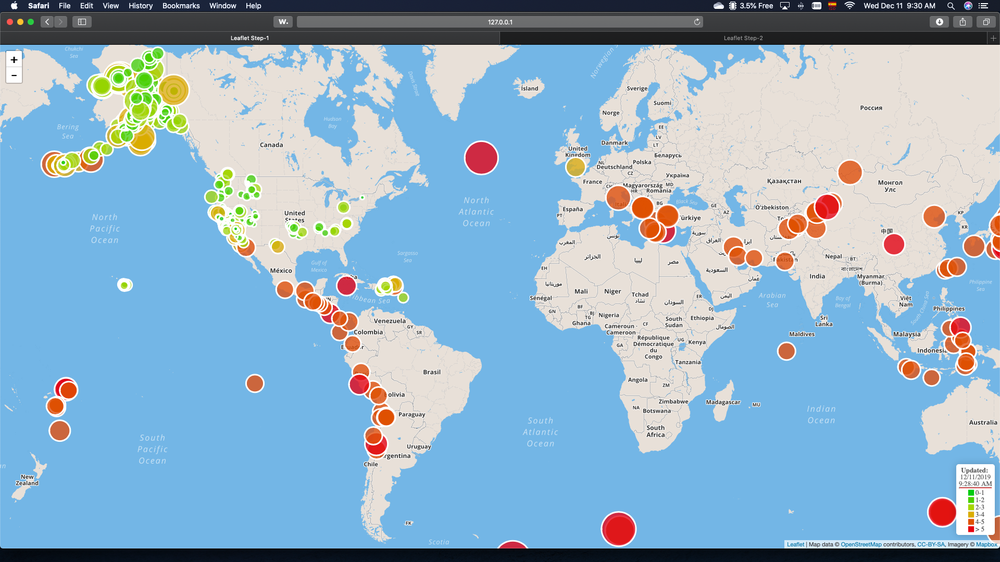
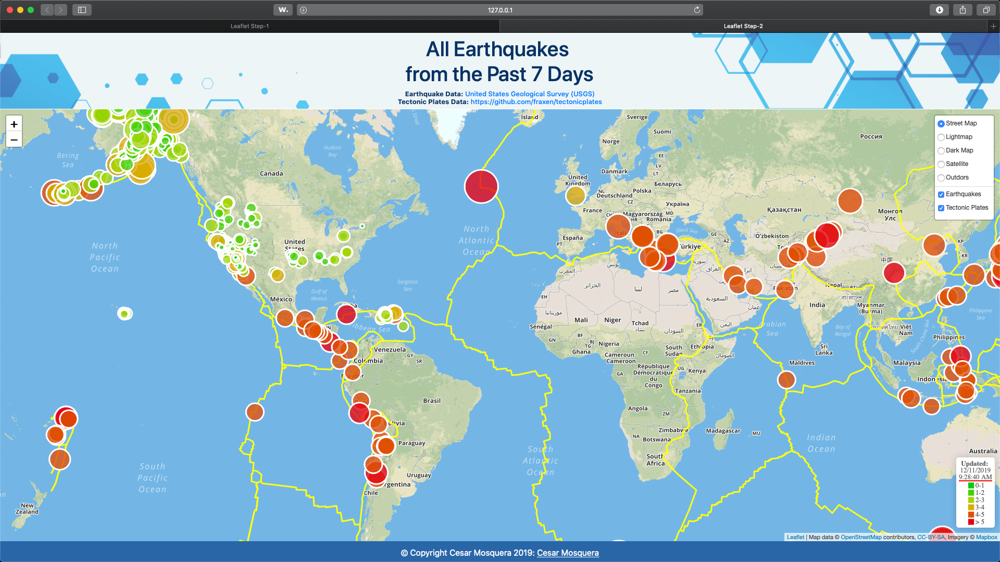

# Project Leaflet

## Project Description
The goal of the project is to use the `Javascript-Leaflet` library to create multiple and interactive maps using `HTML`, `CSS`, `Bootstrap`, and `Javascript`. The Mapbox-API was also used to load the base maps. The project was divided in two steps with different levels of complexity.
- **Step 1:**
A single base layer and one set of data was used:
 * **Base layer:** [mapbox.streets-basic](https://docs.mapbox.com/api/maps/#raster-tiles)
 * **Data layer Source and Data:** 
. * **Source:** [United States Geological Survey (USGS)](https://earthquake.usgs.gov/earthquakes/feed/v1.0/geojson.php)
. * **Data:** [Earthquakes - Last 7 days - All Earthquakes)](https://earthquake.usgs.gov/earthquakes/feed/v1.0/summary/all_week.geojson)
- **Step 2:**
Multiple optional and interactive base layers were included. An additional dataset and plot were included and they can be activated and deactivated by the user.
 * **Base layer:** 
. * [mapbox.light](https://docs.mapbox.com/api/maps)
. * [mapbox.streets](https://docs.mapbox.com/api/maps)
. * [mapbox.dark](https://docs.mapbox.com/api/maps)
. * [mapbox.satellite](https://docs.mapbox.com/api/maps)
. * [mapbox.outdoors](https://docs.mapbox.com/api/maps)
 * **Data layer Source and Data:** 
. * **Layer 1:** Earthquake information
. * **Source:** [United States Geological Survey (USGS)](https://earthquake.usgs.gov/earthquakes/feed/v1.0/geojson.php)
. * **Data:** [Earthquakes - Last 7 days - All Earthquakes)](https://earthquake.usgs.gov/earthquakes/feed/v1.0/summary/all_week.geojson)
. * **Layer 2:** Tectonic Plates
. * **Source:** [Hugo Ahlenius, GIS-and-Cartography Consultant](https://github.com/fraxen/tectonicplates)
. * **Data:** [Tectonic Plates Boundaries](https://raw.githubusercontent.com/fraxen/tectonicplates/master/GeoJSON/PB2002_boundaries.json)

## Libraries Required (already included in the index.html file):
- D3 JavaScript
- Leaflet

### App Running 

- Step 2:

### Sample app Screenshot

 
- Step 1:

- Step 2:

## Instructions

#### Steps
1. - Donwload or clone all the files contained in this repo.
2. - Create a [Mapbox Token](https://account.mapbox.com/auth/signup/)
3. - Include your `Mapbox Token` in the `/Leaflet-Step-1/static/js/config.js` file.
3. - Run a python -m http.server or any other method for this purpose.
4. - Load the `Leaflet-Step-1/index.html` and `Leaflet-Step-2/index.html` files.

# File Description
## - Leaflet-Step-1
- Contains all the files for the first part of the project.
### - index.html
- Contains the html code that drive the maps and references the requiered libraries
### - static
- Contains the `css` file with the formatting information
- Contains the `js` with the `Javascript` code using the D3 library for the interactive plots.
### - Screenshots
- Contains the `gif` and `png` files with screenshots of the app running
## - Leaflet-Step-2
- Contains all the files for the second part of the project.
- All folder are the same with this exception:
### - static
- Contains and additional folder that contains the `json` file with the tectonic-plate-boundaries information